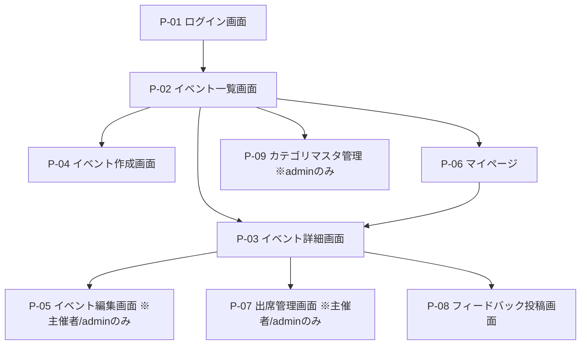
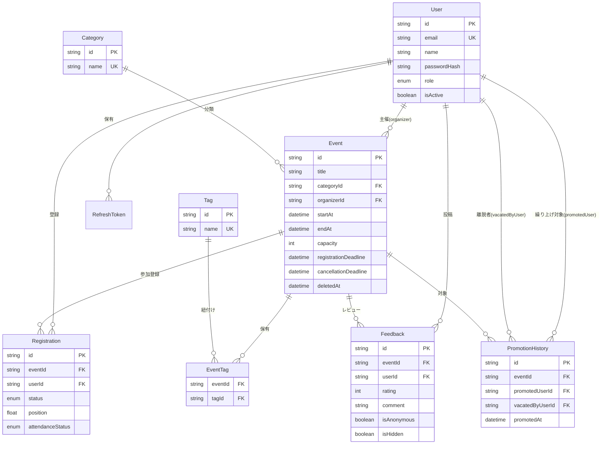

# アプリケーション設計書

本ドキュメントは、社内イベント運営プラットフォーム「EventBoard」の開発チームが参照する公式設計書（最終版）である。
要件定義（別途共有された仕様）、[詳細要求リスト.md](./詳細要求リスト.md)で決定した設計方針を基に、
プロジェクト概要からAPI・DB・権限マトリクス・画面遷移・ディレクトリ構成・開発環境構築までを一貫した仕様として定義する。
個々の決定の比較検討過程は[選定要素提案.md](./選定要素提案.md)を参照。

---

## 1. プロジェクト概要

### 背景・目的

社内で開催される勉強会・懇親会・講演会・研修などのイベントが、告知・参加登録・出席管理・
振り返り（フィードバック）のいずれも属人的・散発的に行われており、参加状況の把握や過去の
参加実績の可視化が難しいという課題がある。本ツールは、イベントの告知から参加登録・出席管理・
フィードバック収集までを一気通貫で扱えるようにすることで、これらの課題を解消することを目的とする。

### 主な利用者

利用者は、システムロール（`member` / `admin`）と、イベントごとに動的に決まる「主催者」という
立場の組み合わせで区別される（詳細は2章「ユーザーロール定義」を参照）。

- **一般社員（システムロール`member`）**: イベント一覧から興味のあるイベントを探し参加登録する。過去の参加実績を振り返り、フィードバックを投稿する。
- **主催者（`member`がイベントを作成した時点で兼務する立場。独立したロールではない）**: 自分が主催するイベントを作成・編集し、参加者・出席状況を管理する。
- **admin（運営担当）**: 全イベント・全ユーザーを俯瞰し、不適切な投稿・イベントを削除する。カテゴリマスタを管理する。

### 提供価値（サマリー）

- カテゴリ・タグ・キーワードでの検索と、空き状況が一目でわかるイベント一覧・詳細
- 定員・登録締切・キャンセル期限を踏まえた参加登録／キャンセル、満席時のキャンセル待ちと自動繰り上げ
- 開催後の出席／欠席マークと、累計参加数・出席率・カテゴリ別傾向の可視化
- 開催終了・出席済みの参加者による星評価＋コメントのフィードバック（匿名投稿対応）
- admin向けのカテゴリマスタ管理・不適切レビューの非公開化

システム構成は全10画面（4章参照）、APIは28エンドポイント（6章参照）、データモデルは8テーブル（5章参照）で構成される。

---

## 2. ユーザーロール定義（RBAC）

### システムロール

| ロール | 概要 |
|---|---|
| `member` | 全社員のデフォルトロール。自身が主催するイベントについてのみ、後述の「主催者」としての操作が可能 |
| `admin` | 全イベント・全ユーザーを操作可能。カテゴリマスタの管理、不適切レビューの非公開化を担当 |

### 「主催者」の扱い

主催者は独立したロール・テーブルを持たない。**`Event.organizerId`（イベント作成者）が
リクエスト実行者と一致するかどうかを、その都度アプリケーション層（CASL）で判定する**方式とする。
理由: 独立ロールにすると「主催を降りる」「主催を移譲する」等の状態管理が余計に必要になり複雑度が
上がる一方、要件上そのような操作は求められていないため。

### 認可方針

- 認可はシステムロール（`User.role`）＋「対象イベントの`organizerId`がログインユーザー本人か」の
  組み合わせで判定する（CASL、`ability.can("update", subject("Event", event))`のような形）。
- admin はこの制約を受けず全イベント・全レビューにアクセス可能。
- 認可判定はNestJSのGuard + CASLで一元的に実施する（6章参照）。

### 権限マトリクス（要件定義7章を踏襲）

| 操作 | member(参加者として) | member(主催者として) | admin |
|---|---|---|---|
| ログイン | ○ | ○ | ○ |
| イベント一覧・詳細閲覧 | ○ | ○ | ○ |
| イベント作成 | ○(作成時点で主催者になる) | - | ○ |
| イベント編集・削除 | ✕ | ○(自分の) | ○(全て) |
| 参加登録・キャンセル(通常期限内) | ○ | ✕(自分主催、暗黙的に参加確定のため登録不要) | ○ |
| 出席マーク | ✕ | ○(自分主催のみ) | ○ |
| フィードバック投稿(条件充足時) | ○ | ✕(自分主催) | ○ |
| カテゴリマスタ管理 | ✕ | ✕ | ○ |
| 不適切レビュー非公開化 | ✕ | ✕ | ○ |

### 権限マトリクス（APIエンドポイント別アクセス可否）

以下は6章で定義した全28エンドポイントについて、ロールごとのアクセス可否を一覧化したものである。

凡例: `✅`=可、`✕`=不可（該当ロールでは実行できない）、`本人`=実行者が対象リソースの当事者（主催者・投稿者等）である場合のみ可

| # | エンドポイント | 未認証 | member(参加者として) | member(主催者として) | admin |
|---|---|---|---|---|---|
| 1 | `POST /auth/login` | ✅ | — | — | — |
| 2 | `POST /auth/refresh` | ✅（Refresh Token必須） | — | — | — |
| 3 | `POST /auth/logout` | ✕ | ✅ | ✅ | ✅ |
| 4 | `GET /auth/me` | ✕ | ✅ | ✅ | ✅ |
| 5 | `PUT /auth/profile` | ✕ | ✅（本人のみ） | ✅（本人のみ） | ✅（本人のみ） |
| 6 | `GET /users` | ✕ | ✕ | ✕ | ✅ |
| 7 | `GET /users/:id` | ✕ | ✕ | ✕ | ✅ |
| 8 | `PUT /users/:id/role` | ✕ | ✕ | ✕ | ✅ |
| 9 | `POST /users/:id/deactivate` | ✕ | ✕ | ✕ | ✅ |
| 10 | `GET /categories` | ✕ | ✅ | ✅ | ✅ |
| 11 | `POST /categories` | ✕ | ✕ | ✕ | ✅ |
| 12 | `PUT /categories/:id` | ✕ | ✕ | ✕ | ✅ |
| 13 | `DELETE /categories/:id` | ✕ | ✕ | ✕ | ✅（紐づくEventがあれば`409`） |
| 14 | `GET /events` | ✕ | ✅ | ✅ | ✅ |
| 15 | `POST /events` | ✕ | ✅（作成時点で主催者になる） | — | ✅ |
| 16 | `GET /events/:id` | ✕ | ✅ | ✅ | ✅ |
| 17 | `PUT /events/:id` | ✕ | ✕ | ✅（自分の） | ✅（全て） |
| 18 | `DELETE /events/:id` | ✕ | ✕ | ✅（自分の） | ✅（全て） |
| 19 | `POST /events/:id/register` | ✕ | ✅ | ✅（自分主催は`409`） | ✅ |
| 20 | `POST /events/:id/cancel` | ✕ | ✅（本人、期限内） | ✅（自分主催は登録自体がなく`409`） | ✅（本人分は期限内、他ユーザー分は期限無視の強制キャンセルとして可） |
| 21 | `GET /events/:id/registrations` | ✕ | ✕ | ✅（自分主催のみ） | ✅（全て） |
| 22 | `PUT /events/:id/registrations/:userId/attendance` | ✕ | ✕ | ✅（自分主催のみ） | ✅（全て） |
| 23 | `GET /events/:id/feedbacks` | ✕ | ✅（非公開分・投稿者情報は非表示） | ✅（同左） | ✅（非公開分・投稿者情報も表示） |
| 24 | `POST /events/:id/feedbacks` | ✕ | ✅（投稿条件充足時のみ） | ✅（自分主催のイベントは`409`） | ✅（投稿条件充足時のみ） |
| 25 | `PUT /feedbacks/:id` | ✕ | ✅（本人＝投稿者のみ） | ✅（本人＝投稿者のみ） | ✕（直接編集不可。非公開化は26番で対応） |
| 26 | `POST /feedbacks/:id/hide` | ✕ | ✕ | ✕ | ✅ |
| 27 | `GET /users/me/events` | ✕ | ✅（本人分のみ） | ✅（本人分のみ） | ✅（本人分のみ） |
| 28 | `GET /users/me/stats` | ✕ | ✅（本人分のみ） | ✅（本人分のみ） | ✅（本人分のみ） |

各エンドポイントの詳細なリクエスト/レスポンス仕様は6章「API設計」を参照。

---

## 3. 機能要件

### 3.1 認証

- メールアドレス＋パスワードでログインする。招待制は採らず、初期ユーザーは`backend/prisma/seed.ts`で作成する（登録APIは提供しない）。
- JWT（Access Token 15分 / Refresh Token 7日）をhttpOnly Cookieで管理する。
- **Access Tokenのペイロードは`{ sub: userId }`のみとし、ロール（`role`）は含めない**。認可判定のたびにDBから
  最新のロール・有効/無効状態（`isActive`）を取得する（`JwtStrategy.validate()`）。理由: 昇格/降格・無効化が
  Access Tokenの残り有効期限（最大15分）に関わらず即座に反映されるようにするため。
- Refresh Tokenは`/auth/refresh`実行のたびにローテーション（旧トークンを`revokedAt`で失効させ新規発行）する。
  DBにはハッシュ値（SHA-256）のみ保存する。
- ログアウト時、サーバー側でRefresh Tokenを失効させる。
- **未実装（今後対応予定）**: 失効済み（ローテーション済み）のRefresh Tokenが再送信された場合、
  トークン盗難とみなして該当ユーザーの全Refresh Tokenを一括失効させる「使い回し検知」機能。

### 3.2 イベント基本機能

- 一覧はカテゴリ絞り込み・キーワード検索（タイトル・説明文の部分一致）・タグ検索・開催日順ソートに対応する。
- 詳細画面では基本情報・参加者リスト・空き状況（`capacity - 現在の確定参加者数`）を表示する。
- 作成は`member`なら誰でも可能（作成時点でそのイベントの主催者になる）。
- 編集・削除は主催者本人とadminのみ可能。
- **過去日時（`startAt <= now`）のイベント作成は禁止**（バリデーションエラー、`400`）。
- **編集で`startAt`を変更する場合**、既に`CONFIRMED`の参加登録者が1人以上いれば、レスポンスに
  `hasRegisteredParticipants: true`を含めてフロントで警告ダイアログを表示する（通知送信は行わない）。
- **削除は論理削除**（`Event.deletedAt`）とする。理由: 参加履歴・出席率・フィードバックの参照整合性を
  削除後も保つ必要があるため（物理削除だと集計値が壊れる）。

### 3.3 参加登録・キャンセル

- 参加登録・キャンセルの2アクションのみをAPIとして提供する（後述6章参照。キャンセル待ちへの参加も
  同じ「参加登録」アクションが定員超過時に自動でキャンセル待ちとして扱う）。
- **定員上限**: `Registration`（`status=CONFIRMED`）件数が`capacity`に達したイベントは、参加登録すると
  自動的にキャンセル待ち（`status=WAITLISTED`）として登録される。
- **登録締切**: `Event.registrationDeadline`（未設定なら`startAt`をデフォルトとして使う）を過ぎたら登録不可（`400`）。
- **キャンセル可能期限**: `Event.cancellationDeadline`（未設定なら`startAt`をデフォルトとして使う）を過ぎたら
  通常キャンセル不可（`403`）。ただしadminは強制キャンセル可能（別エンドポイント、期限を無視する）。
- **過去のイベントには登録不可**（`startAt <= now`、`400`）。
- **同一ユーザーの二重登録防止**: `Registration`に`(eventId, userId)`の一意制約を設定する
  （`CONFIRMED`/`WAITLISTED`いずれの状態であっても再登録は`409`）。
- **主催者は自動的に参加確定として扱う**（`Registration`レコードを作らない。3.2節参照）。
  UI側は「あなたが主催者です」の表示のみ行い、登録・キャンセルボタンは表示しない。

### 3.4 カテゴリ・タグ

- 各イベントは1つの`Category`を必ず持つ。カテゴリマスタの初期値は「勉強会/懇親会/講演会/研修/その他」。
- 各イベントは複数の`Tag`を任意で持てる（自由入力、登録時にtrim＋小文字化のみ行い、本格的なタグマスタ化はしない）。
- タグは中間テーブル（`EventTag`）で多対多として実装する。
- **カテゴリ削除**: 紐づく`Event`が1件でも存在する場合は削除を拒否する（`409`）。DBの外部キー制約
  （`onDelete: Restrict`）をそのまま活用し、アプリケーション層で捕捉して分かりやすいメッセージを返す。
  理由: 移動・論理削除ロジックを追加するより実装が単純で、「イベントが気づかず消える」事故も起きない。

### 3.5 出席管理

- 主催者（および admin）は、開催日時（`startAt`）に達した以降、`CONFIRMED`の参加者に対して
  「出席」「欠席」をマークできる。
- **開催日時に達する前の出席マークは禁止**（`now < event.startAt`なら`400`）。
- **出席マーク後の変更は可能**（誤操作リカバリのため、何度でも上書き可能）。
- マイページには累計参加数・出席率・カテゴリ別参加傾向を表示する。
  **出席率 = 出席回数 ÷ (出席回数 + 欠席回数)**（未マークは分母から除外。`AttendanceStatus`をnull許容にして表現）。

### 3.6 キャンセル待ち＋自動繰り上げ

- 満席時の参加登録は自動的に`Registration.status=WAITLISTED`として登録される（3.3節）。
- 待機順は`position`（Float）で管理する。**新規の待機登録は常に列の末尾（`現在の最大position + 1`）に
  追加するFIFO方式**とする。理由: 待機解除が途中で発生しても、残りの待機者のposition値の相対順序は
  変わらないため、全件再採番が不要でシンプル。
- 誰かが`CONFIRMED`をキャンセルすると、当該イベントの`WAITLISTED`のうち`position`が最小の者を
  自動的に`CONFIRMED`へ繰り上げる。
- **繰り上げ処理はトランザクションで実装**する。イベント行を`SELECT ... FOR UPDATE`でロックした上で、
  「キャンセル対象の削除→先頭待機者の昇格→`PromotionHistory`へのinsert」を1つのトランザクションとして実行する。
- 待機中のユーザーはいつでも待機解除（`Registration`削除、3.3節の「キャンセル」と同一操作）できる。
  待機解除では繰り上げは発生しない（`CONFIRMED`が減るわけではないため）。
- **繰り上げ履歴**（いつ・誰が・誰の代わりに繰り上げられたか）を`PromotionHistory`テーブルに保存する
  （将来の通知機能への布石。今回のスコープでは通知は送信しない）。

### 3.7 フィードバック（星評価＋コメント）

- **投稿条件**: イベントが終了済み（`event.startAt`を過ぎている。終了時刻の概念は`endAt`があれば
  それを、なければ`startAt`を基準とする）かつ、投稿者が当該イベントで`attendanceStatus=ATTENDED`
  としてマークされていること。
- 1〜5星の評価＋一言コメントを投稿できる。匿名投稿オプションあり（`isAnonymous`）。
- **1人1件制限**: `(eventId, userId)`の一意制約により複数回投稿を防ぐ。編集（上書き）は可能。
- イベント詳細画面に平均評価とレビュー一覧を表示する。**非公開化（`isHidden`）されたレビューは
  平均・一覧集計から除外**する。
- **匿名投稿**: 投稿者情報は一般ユーザーには非表示、adminには表示する。
- adminは不適切なレビューを非公開化できる（物理削除はしない）。

---

## 4. 画面遷移・構成

画面・モーダル単位のさらに詳細な仕様（レイアウト構成・状態遷移図・UI/UX設計方針）は
[画面設計仕様.md](./画面設計仕様.md)を参照。本章ではその全体像のみ示す。

### 画面階層



### 画面一覧

| 画面 | 役割 | アクセス権 | URL(案) |
|---|---|---|---|
| P-01 ログイン画面 | メール・パスワードでログイン | 全員（未ログイン） | `/login` |
| P-02 イベント一覧画面 | 検索・カテゴリ絞り込み・タグ検索・イベントカード一覧、新規作成導線 | 全員（ログイン済み） | `/events` |
| P-03 イベント詳細画面 | 基本情報・参加者リスト・空き状況・登録/キャンセルボタン・レビュー一覧 | 全員（ログイン済み） | `/events/:eventId` |
| P-04 イベント作成画面 | タイトル・説明・開催日時・定員・締切・カテゴリ・タグ入力フォーム | 全員（ログイン済み） | `/events/new` |
| P-05 イベント編集画面 | 作成画面と同一フォーム＋警告表示 | 主催者本人、admin | `/events/:eventId/edit` |
| P-06 マイページ | 主催イベント／参加予定／参加履歴／累計参加数・出席率・カテゴリ別集計 | 全員（ログイン済み） | `/my-page` |
| P-07 出席管理画面 | 参加者リスト＋各人への出席/欠席マーク | 主催者本人、admin | `/events/:eventId/attendance` |
| P-08 フィードバック投稿画面 | 星評価・コメント・匿名フラグ入力 | 投稿条件を満たす参加者、admin | `/events/:eventId/feedback` |
| P-09 カテゴリマスタ管理 | カテゴリ一覧＋追加・編集・削除 | admin | `/admin/categories` |
| P-10 404/エラー画面 | 権限外・存在しないURLへのアクセス時 | 全員 | `*` |

---

## 5. データモデリング

### 5.1 ER図



### 5.2 テーブル定義（要点）

#### Category（カテゴリマスタ）

| カラム | 型 | 制約 | 説明 |
|---|---|---|---|
| `id` | String | PK | |
| `name` | String | UNIQUE | 表示名（勉強会/懇親会/講演会/研修/その他、admin追加可） |

**ビジネスルール**: 紐づく`Event`が1件でも存在する場合、削除は`onDelete: Restrict`により拒否（`409`）。

#### Tag / EventTag（タグ）

| モデル | カラム | 説明 |
|---|---|---|
| `Tag` | `id`, `name`(UNIQUE) | 自由入力タグ。登録時にtrim+小文字化 |
| `EventTag` | `eventId`, `tagId` | 多対多の中間テーブル。`@@unique([eventId, tagId])` |

#### Event（イベント）

| カラム | 型 | 制約 | 説明 |
|---|---|---|---|
| `id` | String | PK | |
| `title` | String | NOT NULL | タイトル |
| `description` | String | NULL可 | 説明文（検索対象） |
| `categoryId` | String | FK→Category, NOT NULL | カテゴリ（`onDelete: Restrict`） |
| `organizerId` | String | FK→User, NOT NULL | 主催者（作成者） |
| `startAt` | DateTime | NOT NULL | 開催日時 |
| `endAt` | DateTime | NULL可 | 終了日時（フィードバック投稿可否・表示用。未設定時は`startAt`を終了とみなす） |
| `capacity` | Int | NOT NULL, `>=1` | 定員 |
| `registrationDeadline` | DateTime | NULL可 | 登録締切（未設定時は`startAt`をデフォルトとして扱う） |
| `cancellationDeadline` | DateTime | NULL可 | キャンセル可能期限（未設定時は`startAt`をデフォルトとして扱う） |
| `deletedAt` | DateTime | NULL可 | 論理削除日時 |
| `createdAt`/`updatedAt` | DateTime | | |

**ビジネスルール**: 作成時`startAt > now`必須（`400`）。編集で`startAt`を変更し`CONFIRMED`登録者が
存在する場合はレスポンスに警告フラグを含める（3.2節）。

#### Registration（参加登録／キャンセル待ち）

| カラム | 型 | 制約 | 説明 |
|---|---|---|---|
| `id` | String | PK | |
| `eventId` | String | FK→Event, NOT NULL | |
| `userId` | String | FK→User, NOT NULL | |
| `status` | Enum(`RegistrationStatus`) | NOT NULL | `CONFIRMED` / `WAITLISTED` |
| `position` | Float | NULL可 | `WAITLISTED`の場合のみ意味を持つ待機順。`CONFIRMED`では`null` |
| `attendanceStatus` | Enum(`AttendanceStatus`) | NULL可 | `ATTENDED` / `ABSENT`。未マークは`null` |
| `createdAt`/`updatedAt` | DateTime | | |

**制約**: `@@unique([eventId, userId])`で二重登録・二重待機登録を防止する。
主催者本人の分のレコードは作らない（3.2節「主催者は暗黙的に参加確定」）。
このテーブルはキャンセルされない限り開催後も保持し続け、マイページの参加履歴・出席率集計の元データとなる。

#### PromotionHistory（繰り上げ履歴）

| カラム | 型 | 説明 |
|---|---|---|
| `id` | String | PK |
| `eventId` | String | FK→Event |
| `promotedUserId` | String | FK→User（繰り上げられた人） |
| `vacatedByUserId` | String | FK→User（キャンセルして枠を空けた人） |
| `promotedAt` | DateTime | 繰り上げ日時 |

#### Feedback（フィードバック）

| カラム | 型 | 制約 | 説明 |
|---|---|---|---|
| `id` | String | PK | |
| `eventId` | String | FK→Event, NOT NULL | |
| `userId` | String | FK→User, NOT NULL | 投稿者（匿名投稿でも内部的には保持） |
| `rating` | Int | NOT NULL, `1〜5` | 星評価 |
| `comment` | String | NOT NULL | コメント |
| `isAnonymous` | Boolean | DEFAULT `false` | 匿名投稿フラグ（一般ユーザーには投稿者非表示、adminには表示） |
| `isHidden` | Boolean | DEFAULT `false` | admin による非公開化フラグ（集計除外） |
| `createdAt`/`updatedAt` | DateTime | | |

**制約**: `@@unique([eventId, userId])`で1人1件に制限。

### 5.3 削除・無効化ポリシー

| リソース | 方式 | 補足 |
|---|---|---|
| User | 論理削除（`isActive=false`、既存実装） | 物理削除は提供しない |
| Category | 物理削除（紐づくEventがなければ） | 紐づくEventがあれば`409`で拒否 |
| Event | 論理削除（`deletedAt`） | 参加履歴・出席率・フィードバックの整合性を保つため |
| Registration | 物理削除（キャンセル＝行削除） | キャンセル待ちの離脱も同様 |
| Feedback | 論理的な非公開化（`isHidden`） | 物理削除は行わない |

### 5.4 Prismaスキーマ（追加分）

`User`/`RefreshToken`は実装済み（[CLAUDE.md](./CLAUDE.md)参照）。以下を追加する。

```prisma
enum RegistrationStatus {
  CONFIRMED
  WAITLISTED
}

enum AttendanceStatus {
  ATTENDED
  ABSENT
}

model Category {
  id    String  @id @default(cuid())
  name  String  @unique
  events Event[]

  @@map("categories")
}

model Tag {
  id   String @id @default(cuid())
  name String @unique

  eventTags EventTag[]

  @@map("tags")
}

model EventTag {
  eventId String
  tagId   String

  event Event @relation(fields: [eventId], references: [id], onDelete: Cascade)
  tag   Tag   @relation(fields: [tagId], references: [id], onDelete: Cascade)

  @@unique([eventId, tagId])
  @@index([tagId])
  @@map("event_tags")
}

model Event {
  id                    String    @id @default(cuid())
  title                 String
  description           String?
  categoryId            String
  organizerId           String
  startAt               DateTime  @db.Timestamptz(3)
  endAt                 DateTime? @db.Timestamptz(3)
  capacity              Int
  registrationDeadline  DateTime? @db.Timestamptz(3)
  cancellationDeadline  DateTime? @db.Timestamptz(3)
  deletedAt             DateTime? @db.Timestamptz(3)
  createdAt             DateTime  @default(now()) @db.Timestamptz(3)
  updatedAt             DateTime  @updatedAt @db.Timestamptz(3)

  category  Category @relation(fields: [categoryId], references: [id], onDelete: Restrict)
  organizer User     @relation(fields: [organizerId], references: [id], onDelete: Restrict)

  eventTags         EventTag[]
  registrations     Registration[]
  feedbacks         Feedback[]
  promotionHistories PromotionHistory[]

  @@index([categoryId])
  @@index([organizerId])
  @@index([startAt])
  @@map("events")
}

model Registration {
  id               String             @id @default(cuid())
  eventId          String
  userId           String
  status           RegistrationStatus
  position         Float?
  attendanceStatus AttendanceStatus?
  createdAt        DateTime           @default(now()) @db.Timestamptz(3)
  updatedAt        DateTime           @updatedAt @db.Timestamptz(3)

  event Event @relation(fields: [eventId], references: [id], onDelete: Cascade)
  user  User  @relation(fields: [userId], references: [id], onDelete: Cascade)

  @@unique([eventId, userId])
  @@index([eventId, status, position])
  @@index([userId])
  @@map("registrations")
}

model PromotionHistory {
  id              String   @id @default(cuid())
  eventId         String
  promotedUserId  String
  vacatedByUserId String
  promotedAt      DateTime @default(now()) @db.Timestamptz(3)

  event         Event @relation(fields: [eventId], references: [id], onDelete: Cascade)
  promotedUser  User  @relation("PromotionPromotedUser", fields: [promotedUserId], references: [id], onDelete: Cascade)
  vacatedByUser User  @relation("PromotionVacatedByUser", fields: [vacatedByUserId], references: [id], onDelete: Cascade)

  @@index([eventId])
  @@map("promotion_histories")
}

model Feedback {
  id          String   @id @default(cuid())
  eventId     String
  userId      String
  rating      Int
  comment     String
  isAnonymous Boolean  @default(false)
  isHidden    Boolean  @default(false)
  createdAt   DateTime @default(now()) @db.Timestamptz(3)
  updatedAt   DateTime @updatedAt @db.Timestamptz(3)

  event Event @relation(fields: [eventId], references: [id], onDelete: Cascade)
  user  User  @relation(fields: [userId], references: [id], onDelete: Cascade)

  @@unique([eventId, userId])
  @@index([eventId])
  @@map("feedbacks")
}
```

`User`モデルには上記の逆リレーション（`organizedEvents`, `registrations`, `feedbacks`,
`promotionsReceived`, `promotionsCausedByCancel`）を追加する。

### 5.5 Prisma標準機能を超える制約

| 制約 | 対象 | 内容 |
|---|---|---|
| CHECK制約 | `events` | `capacity >= 1` |
| CHECK制約 | `feedbacks` | `rating BETWEEN 1 AND 5` |
| アプリケーション層のみで担保 | `events` | 作成時`startAt > now`（時刻依存のためDB制約では表現しない） |
| アプリケーション層のみで担保 | `registrations` | 定員判定・締切判定・出席マーク可否判定（すべて「現在時刻」に依存するため） |

---

## 6. API設計

### 設計方針

- REST形式、リソース単位のパス設計とする。
- 状態遷移・副作用を伴う操作は専用アクションエンドポイントとしてPOSTで表現する
  （例: `/events/:id/register`, `/events/:id/cancel`）。単純な部分更新はPUT/PATCHを使う。
- **参加登録は「登録」「キャンセル」の2アクションのみ**とする。満席時のキャンセル待ちは
  `POST /events/:id/register`が定員超過を検知して自動的に`WAITLISTED`として登録し、
  レスポンスの`status`で結果を返す。待機解除も`POST /events/:id/cancel`と同一操作とする。
  理由: エンドポイントを分けず1系統にすることで、フロントは「登録ボタン/キャンセルボタン」の
  2状態だけを扱えばよくなり複雑度が下がる。
- イベント詳細・一覧のレスポンスには、ログインユーザー視点の`registrationState`
  （`NOT_REGISTERED` / `CONFIRMED` / `WAITLISTED` / `ORGANIZER` / `CLOSED`等）をサーバー側で
  計算して含める。ボタンの出し分けロジックをフロントに持たせない（選定要素提案.md 7章）。
- 認可はJwtAuthGuard + PoliciesGuard（CASL）で一元的に実施する（既存実装を継続）。
- エラーレスポンスは`{ success: false, error: { code, message } }`で統一する（既存実装を継続）。
- ページネーションは当面省略（社内規模であれば一覧を全件返却しても問題ない想定）。必要になれば
  オフセット方式を追加する。

### 主要リソース一覧

| リソース | 概要 | 認可 |
|---|---|---|
| `POST /auth/login`, `/auth/refresh`, `/auth/logout`, `GET /auth/me`, `PUT /auth/profile` | 認証（実装済み） | ログイン系のみ認証不要 |
| `GET /categories` | カテゴリ一覧取得 | 全員（ログイン済み） |
| `POST /categories`, `PUT /categories/:id`, `DELETE /categories/:id` | カテゴリマスタ管理 | admin |
| `GET /events` | イベント一覧（`?category=&keyword=&tags=&sort=`） | 全員（ログイン済み） |
| `POST /events` | イベント作成 | 全員（ログイン済み） |
| `GET /events/:id` | イベント詳細（参加者リスト・空き状況・`registrationState`を含む） | 全員（ログイン済み） |
| `PUT /events/:id` | イベント編集 | 主催者本人、admin |
| `DELETE /events/:id` | イベント削除（論理削除） | 主催者本人、admin |
| `POST /events/:id/register` | 参加登録（満席時は自動的にキャンセル待ち） | 全員（ログイン済み、主催者本人は`409`） |
| `POST /events/:id/cancel` | キャンセル（`CONFIRMED`/`WAITLISTED`共通、繰り上げ処理を内包） | 本人（期限内） / admin（強制、期限無視） |
| `GET /events/:id/registrations` | 参加者一覧（出席状態含む） | 主催者本人、admin |
| `PUT /events/:id/registrations/:userId/attendance` | 出席／欠席マーク | 主催者本人、admin |
| `GET /events/:id/feedbacks` | レビュー一覧・平均評価（非公開分は除外。adminには非公開分含め投稿者情報も表示） | 全員（ログイン済み） |
| `POST /events/:id/feedbacks` | フィードバック投稿（条件充足時のみ） | 投稿条件を満たす本人、admin |
| `PUT /feedbacks/:id` | フィードバック編集 | 投稿者本人 |
| `POST /feedbacks/:id/hide` | 不適切レビューの非公開化 | admin |
| `GET /users/me/events` | マイページ用（主催イベント・参加予定・参加履歴） | 本人 |
| `GET /users/me/stats` | 累計参加数・出席率・カテゴリ別傾向 | 本人 |

### 詳細API仕様

共通事項: 成功レスポンスは`{ "success": true, "data": {...} }`、エラーレスポンスは
`{ "success": false, "error": { "code": "...", "message": "..." } }`の形式に統一する。
日時はすべてISO8601（UTC）で表現し、フロント側でJSTに変換して表示する。

#### 1. POST /auth/login（実装済み）

* 概要: メールアドレス・パスワードでログインする。
* 認可: 不要（未ログイン状態でアクセス可能）
* Body: `email`(String, 必須), `password`(String, 必須)
* Success `200`: `data`はユーザー情報（`id`, `name`, `email`, `role`）。Access/Refresh Tokenを`Set-Cookie`で発行
* Errors: `400`(バリデーションエラー) / `401`(メールアドレスまたはパスワードが誤っている、または無効化済み)

#### 2. POST /auth/refresh（実装済み）

* 概要: Cookie内のRefresh Tokenを検証し、Access/Refresh Tokenをローテーション発行する。
* 認可: 有効なRefresh Token Cookieが必須（Access Tokenは不要）
* Success `200`: `data`は空オブジェクト。新しいAccess/Refresh Tokenを`Set-Cookie`で発行
* Errors: `401`(Refresh Tokenが無効・期限切れ・未送信)

#### 3. POST /auth/logout（実装済み）

* 概要: ログアウトする。サーバー側でRefresh Tokenを失効させ、Cookieを削除する。
* 認可: 要認証
* Success `200`: `data`は空オブジェクト。Access/Refresh TokenのCookieを削除
* Errors: `401`(未認証)

#### 4. GET /auth/me（実装済み）

* 概要: ログイン中の本人情報を取得する。
* 認可: 要認証
* Success `200`: `data`は`id`, `name`, `email`, `role`
* Errors: `401`(未認証・無効化済み)

#### 5. PUT /auth/profile（実装済み）

* 概要: ログイン中の本人のプロフィール（表示名）を更新する。
* 認可: 要認証（更新対象は常に本人のみ）
* Body: `name`(String, 必須)
* Success `200`: `data`は更新後のユーザー情報
* Errors: `400`(バリデーションエラー) / `401`(未認証)

#### 6. GET /users（実装済み）

* 概要: 全ユーザーの一覧を取得する。
* 認可: adminのみ
* Success `200`: `data`は`{ id, name, email, role, isActive, createdAt }`の配列
* Errors: `401` / `403`

#### 7. GET /users/:id（実装済み）

* 概要: 指定した単一ユーザーの詳細を取得する。
* 認可: adminのみ
* Success `200`: `data`は6と同じ形
* Errors: `401` / `403` / `404`

#### 8. PUT /users/:id/role（実装済み）

* 概要: 指定したユーザーのシステムロールを変更する。
* 認可: adminのみ
* Body: `role`(`ADMIN`|`MEMBER`, 必須)
* Success `200`: `data`は変更後のユーザー情報
* Errors: `400` / `401` / `403` / `404` / `409`(唯一の有効Adminを降格しようとした場合)

#### 9. POST /users/:id/deactivate（実装済み）

* 概要: 指定したユーザーを無効化する（論理無効化、`isActive=false`）。
* 認可: adminのみ
* Success `200`: `data`は無効化後のユーザー情報
* Errors: `401` / `403` / `404` / `409`(自分自身を対象にした場合、または唯一の有効Adminを無効化しようとした場合)

#### 10. GET /categories

* 概要: カテゴリマスタの一覧を取得する。
* 認可: 要認証（全ロール）
* Success `200`: `data`は`{ id, name }`の配列
* Errors: `401`

#### 11. POST /categories

* 概要: カテゴリを新規追加する。
* 認可: adminのみ
* Body: `name`(String, 必須, 一意)
* Success `201`: `data`は作成後のカテゴリ
* Errors: `400` / `401` / `403` / `409`(同名カテゴリが既に存在)

#### 12. PUT /categories/:id

* 概要: カテゴリ名を編集する。
* 認可: adminのみ
* Body: `name`(String, 必須)
* Success `200`: `data`は更新後のカテゴリ
* Errors: `400` / `401` / `403` / `404` / `409`(同名カテゴリが既に存在)

#### 13. DELETE /categories/:id

* 概要: カテゴリを削除する。
* 認可: adminのみ
* Success `204`
* Errors: `401` / `403` / `404` / `409`(紐づく`Event`が1件でも存在する場合。3.4節参照)

#### 14. GET /events

* 概要: イベント一覧を取得する。カテゴリ絞り込み・キーワード検索・タグ検索・開催日順ソートに対応する。
* 認可: 要認証（全ロール）
* Query: `category`(カテゴリID, 任意), `keyword`(タイトル・説明文の部分一致, 任意), `tags`(タグ名のカンマ区切り, 任意), `sort`(`startAtAsc`|`startAtDesc`, デフォルト`startAtAsc`)
* Success `200`: `data`は`{ id, title, category, startAt, capacity, confirmedCount, registrationState }`の配列（論理削除済みは除外）
* Errors: `401`

#### 15. POST /events

* 概要: イベントを新規作成する（作成者が自動的に主催者になる）。
* 認可: 要認証（全ロール）
* Body: `title`(必須), `description`(任意), `categoryId`(必須), `tags`(String配列, 任意), `startAt`(必須), `endAt`(任意), `capacity`(Int, 必須, `>=1`), `registrationDeadline`(任意), `cancellationDeadline`(任意)
* Success `201`: `data`は作成後のイベント詳細
* Errors: `400`(バリデーションエラー。`startAt`が過去日時の場合を含む) / `401` / `404`(`categoryId`が存在しない)

#### 16. GET /events/:id

* 概要: イベント詳細を取得する。基本情報・参加者リスト・空き状況・`registrationState`・レビュー一覧（平均評価含む）を返す。
* 認可: 要認証（全ロール）
* Success `200`: `data`は`title`, `description`, `category`, `tags`, `organizer`, `startAt`, `endAt`, `capacity`, `confirmedCount`, `waitlistedCount`, `registrationDeadline`, `cancellationDeadline`, `registrationState`(`NOT_REGISTERED`|`CONFIRMED`|`WAITLISTED`|`ORGANIZER`|`CLOSED`), `averageRating`, `feedbackCount`
* Errors: `401` / `404`(存在しない、または論理削除済み)

#### 17. PUT /events/:id

* 概要: イベントを編集する。
* 認可: 主催者本人、admin
* Body: 15と同じ項目（部分更新可）
* Success `200`: `data`は更新後のイベント詳細。`startAt`変更時、`CONFIRMED`登録者が1人以上いれば`hasRegisteredParticipants: true`を含める
* Errors: `400` / `401` / `403`(主催者本人でもadminでもない) / `404`

#### 18. DELETE /events/:id

* 概要: イベントを削除する（論理削除、`deletedAt`設定）。
* 認可: 主催者本人、admin
* Success `204`
* Errors: `401` / `403` / `404`

#### 19. POST /events/:id/register

* 概要: 参加登録する。定員に達している場合は自動的にキャンセル待ち登録として扱う。
* 認可: 要認証（主催者本人は`409`）
* Success `200`: `data`は`{ status: "CONFIRMED"|"WAITLISTED", position }`
* Errors: `400`(登録締切超過、過去のイベント) / `401` / `404` / `409`(主催者本人、または既に登録・待機登録済み)

#### 20. POST /events/:id/cancel

* 概要: 参加登録（`CONFIRMED`）またはキャンセル待ち（`WAITLISTED`）を取り消す。`CONFIRMED`の取り消し時は繰り上げ処理（3.6節）を実行する。
* Body: `userId`(任意。adminが他ユーザーを強制キャンセルする場合のみ指定。未指定時は本人が対象)
* 認可: 本人（キャンセル可能期限内）、admin（`userId`指定時は期限を無視した強制キャンセルとして実行）
* Success `200`: `data`は空オブジェクト
* Errors: `401` / `403`(期限超過、かつadminによる強制指定でない) / `404`(登録が存在しない)

#### 21. GET /events/:id/registrations

* 概要: 参加者一覧を取得する（各人の出席状態を含む）。
* 認可: 主催者本人、admin
* Success `200`: `data`は`{ userId, name, status, attendanceStatus }`の配列
* Errors: `401` / `403` / `404`

#### 22. PUT /events/:id/registrations/:userId/attendance

* 概要: 指定した参加者の出席／欠席をマークする。マーク後の変更も同エンドポイントで可能。
* 認可: 主催者本人、admin
* Body: `attendanceStatus`(`ATTENDED`|`ABSENT`, 必須)
* Success `200`: `data`は更新後の参加登録情報
* Errors: `400`(開催日時前) / `401` / `403` / `404`

#### 23. GET /events/:id/feedbacks

* 概要: レビュー一覧・平均評価を取得する。非公開化（`isHidden`）されたレビューは一般ユーザーには含めず、平均評価の算出からも除外する。adminには非公開分も含め投稿者情報とあわせて返す。
* 認可: 要認証（全ロール）
* Success `200`: `data`は`{ averageRating, feedbacks: [{ id, rating, comment, isAnonymous, author(匿名時はnull、admin閲覧時のみ常に含む), isHidden(adminのみ) }] }`
* Errors: `401` / `404`

#### 24. POST /events/:id/feedbacks

* 概要: フィードバックを投稿する。
* 認可: 投稿条件（開催終了済み＋`attendanceStatus=ATTENDED`）を満たす本人、admin
* Body: `rating`(Int, 必須, `1〜5`), `comment`(String, 必須), `isAnonymous`(Boolean, デフォルト`false`)
* Success `201`: `data`は投稿したフィードバック
* Errors: `400` / `401` / `403`(投稿条件未充足) / `409`(既に投稿済み)

#### 25. PUT /feedbacks/:id

* 概要: 自身が投稿したフィードバックを編集する。
* 認可: 投稿者本人のみ（adminも含め他者は不可。非公開化は26番で対応）
* Body: 24と同じ項目
* Success `200`: `data`は更新後のフィードバック
* Errors: `400` / `401` / `403`(投稿者本人でない) / `404`

#### 26. POST /feedbacks/:id/hide

* 概要: 不適切なレビューを非公開化する（`isHidden=true`。再表示用のtoggleは今回のスコープでは提供しない）。
* 認可: adminのみ
* Success `200`: `data`は更新後のフィードバック
* Errors: `401` / `403` / `404`

#### 27. GET /users/me/events

* 概要: マイページ用に、自身が主催するイベント・参加予定イベント・参加履歴を取得する。
* 認可: 要認証（本人分のみ）
* Success `200`: `data`は`{ organizing: [...], upcoming: [...], history: [...] }`
* Errors: `401`

#### 28. GET /users/me/stats

* 概要: マイページ用に、累計参加数・出席率・カテゴリ別参加傾向を取得する。
* 認可: 要認証（本人分のみ）
* Success `200`: `data`は`{ totalParticipations, attendanceRate, byCategory: [{ category, count }] }`（出席率は出席回数÷(出席回数+欠席回数)、未マークは分母から除外）
* Errors: `401`

---

## 7. 技術スタック

[CLAUDE.md](./CLAUDE.md)「技術スタック」章を参照。要点のみ再掲する。

- モノレポ: pnpm workspace + turbo
- BE: NestJS + Prisma + PostgreSQL、JWT(Access+Refresh)、CASL、bcrypt、Zod(nestjs-zod)
- FE: Vite + React + TypeScript + Tailwind、React Router、TanStack Query、React Hook Form + Zod
- テスト: Jest(backend) / Vitest+Playwright(frontend)
- 通知基盤(BullMQ/Redis/メール送信)は今回未導入（5章「機能要件」の通り通知機能は対象外）

---

## 8. ディレクトリ構成

[CLAUDE.md](./CLAUDE.md)「ディレクトリ構成」章を参照。イベント関連の新規モジュールは
`backend/src/modules/{categories,events,registrations,feedbacks}`のように機能単位で追加していく。

---

## 9. 開発環境構築

```bash
cp .env.example .env   # 済み。値は必要に応じて変更
docker compose up --build
```

起動後: backend `http://localhost:3000`、frontend `http://localhost:5173`、
db `localhost:5433`（ホストから直接接続する場合）。

初期データは`backend/prisma/seed.ts`で投入する
（admin: `SEED_ADMIN_EMAIL`/`SEED_ADMIN_PASSWORD`、member: サンプル3名、共通パスワード`Password123!`）。
カテゴリマスタの初期値（勉強会/懇親会/講演会/研修/その他）もseedで投入する（Prismaスキーマ追加時に実装）。

---

## 10. 未実装・スコープ外（マニフェスト記載事項）

要件定義で「推奨(Should)」とされた機能のうち、以下を今回のスコープに含める/含めない。

| 機能 | 対応 |
|---|---|
| キャンセル待ち＋自動繰り上げ | 実装する（3.6節） |
| フィードバック（星評価＋コメント） | 実装する（3.7節） |
| 通知（メール・アプリ内通知） | **未実装**。`PromotionHistory`テーブルのみ将来への布石として保持 |
| カテゴリの論理削除・別カテゴリへの自動移動 | 未採用。物理削除拒否方式のみ実装（4章参照） |
| タグマスタ化・タグの正規化強化 | 未実装。trim+小文字化のみ |
| ページネーション | 未実装（社内規模のため一覧全件返却） |
| Refresh Tokenの使い回し検知（トークン盗難対策） | **未実装**。失効済みトークン再送信時の全セッション強制失効は今後対応予定（3.1節参照） |
