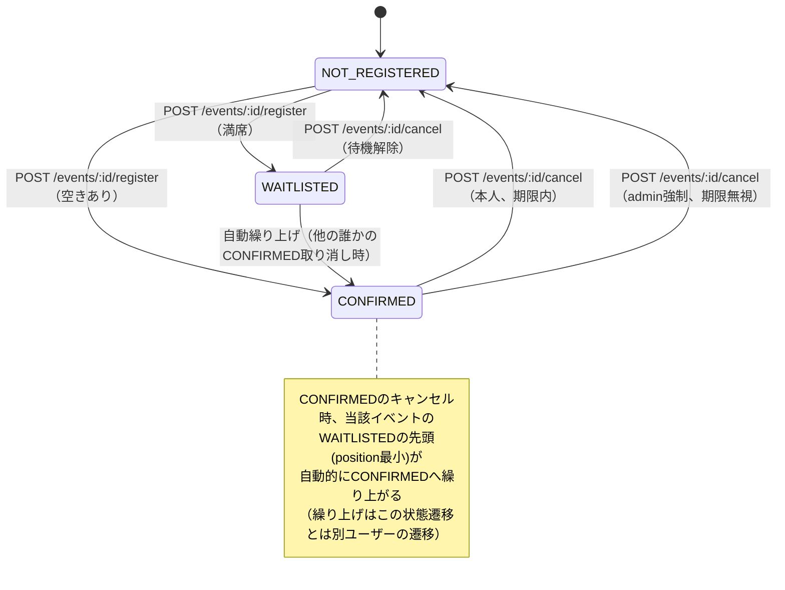
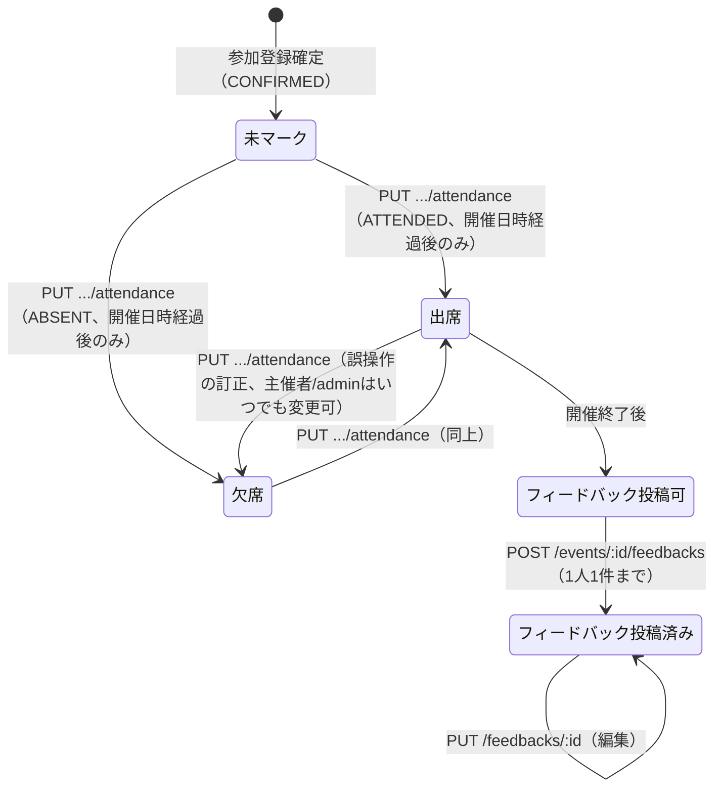

# 画面設計仕様

本ドキュメントは、[MANIFEST.md](./MANIFEST.md)の「4. 画面遷移・構成」「6. API設計」を基に、画面・モーダル単位で仕様を詳細化したものである。

---

## 1. ページ一覧

| ID | 画面名 | URL | 概要 | アクセス権 |
|---|---|---|---|---|
| P-01 | ログイン画面 | `/login` | メールアドレス・パスワードでログインする（`POST /auth/login`）。未ログイン時のエントリーポイント | 全員（未ログイン） |
| P-02 | イベント一覧画面 | `/events` | カテゴリ絞り込み・キーワード検索・タグ検索・開催日順ソートに対応したイベントカード一覧（`GET /events`）。ログイン後のホーム画面。「新規作成」導線を持つ | 全員（ログイン済み） |
| P-03 | イベント詳細画面 | `/events/:eventId` | 基本情報・参加者リスト・空き状況・参加登録/キャンセルボタン・レビュー一覧を表示する（`GET /events/:id`）。ボタンの状態はサーバー計算の`registrationState`をそのまま反映する | 全員（ログイン済み） |
| P-04 | イベント作成画面 | `/events/new` | タイトル・説明・開催日時・定員・登録締切・キャンセル期限・カテゴリ・タグを入力し作成する（`POST /events`）。作成者が自動的に主催者になる | 全員（ログイン済み） |
| P-05 | イベント編集画面 | `/events/:eventId/edit` | P-04と同一フォーム。保存時に`hasRegisteredParticipants: true`が返った場合、開催日時変更警告モーダル（M-08）を表示する（`PUT /events/:id`）。イベント削除ボタンも持つ（M-02起動） | 主催者本人、admin |
| P-06 | マイページ | `/my-page` | 主催イベント・参加予定イベント・参加履歴（`GET /users/me/events`）、累計参加数・出席率・カテゴリ別集計（`GET /users/me/stats`）を表示する | 全員（ログイン済み） |
| P-07 | 出席管理画面 | `/events/:eventId/attendance` | 参加者一覧＋各人への出席/欠席マーク（`GET`/`PUT /events/:id/registrations(/:userId/attendance)`）。開催日時前はマーク操作自体を無効化表示する | 主催者本人、admin |
| P-08 | フィードバック投稿画面 | `/events/:eventId/feedback` | 星評価・コメント・匿名フラグを入力する（`POST`/`PUT /events/:id/feedbacks`, `/feedbacks/:id`）。投稿条件未充足時はアクセスできず、理由を表示してP-03へ戻す導線を出す | 投稿条件を満たす本人、admin |
| P-09 | カテゴリマスタ管理 | `/admin/categories` | カテゴリ一覧（`GET /categories`）＋追加（M-01起動、`POST /categories`）・編集（M-01起動、`PUT /categories/:id`）・削除（M-03起動、`DELETE /categories/:id`） | admin |
| P-10 | 404/エラー画面 | `*` | 存在しないURL、権限のないリソースへのアクセス時に表示する共通エラー画面 | 全員 |

---

## 2. モーダル一覧

| ID | モーダル名 | トリガー（操作） | 主な機能 |
|---|---|---|---|
| M-01 | カテゴリ追加/編集モーダル | カテゴリマスタ管理画面（P-09）の「＋追加」ボタン、各カテゴリの「編集」ボタン | カテゴリ名の入力（`POST`/`PUT /categories`(`/:id`)）。同名カテゴリが既に存在する場合は`409`をフィールドエラーとして表示 |
| M-02 | イベント削除確認モーダル | イベント詳細画面（P-03）・イベント編集画面（P-05）の「削除」ボタン（主催者本人/adminのみ表示） | 「削除すると一覧・検索結果から表示されなくなります」の確認のみ。確定で`DELETE /events/:id`を実行しP-02へ遷移 |
| M-03 | カテゴリ削除確認モーダル | カテゴリマスタ管理画面（P-09）の「削除」ボタン | 確認のみ。確定で`DELETE /categories/:id`を実行。紐づくイベントが存在する場合のサーバー側`409`エラーをモーダル内にそのまま表示する（3.3節参照） |
| M-04 | 参加キャンセル確認モーダル | イベント詳細画面（P-03）の「キャンセルする」/「キャンセル待ちをやめる」ボタン | 確認のみ。確定で`POST /events/:id/cancel`を実行。`CONFIRMED`のキャンセル時は「あなたの代わりに繰り上げが発生する場合があります」の注記を表示する |
| M-05 | 強制キャンセル確認モーダル | 出席管理画面（P-07）・イベント詳細画面（P-03）の参加者一覧内、対象ユーザー行の「強制キャンセル」ボタン（adminのみ表示） | 「キャンセル可能期限を過ぎていても強制的にキャンセルします」の警告付き確認。確定で`POST /events/:id/cancel`（`userId`指定）を実行 |
| M-06 | フィードバック非公開化確認モーダル | イベント詳細画面（P-03）のレビュー一覧内、各レビューの「非公開化」ボタン（adminのみ表示） | 確認のみ。確定で`POST /feedbacks/:id/hide`を実行。非公開化は取り消し不可である旨を明記する |
| M-07 | 汎用確認ダイアログ（基盤コンポーネント） | M-02〜M-06はすべて本コンポーネント（`ConfirmDialog`）をベースにする | タイトル・本文・確定/キャンセルボタンのみを持つ軽量モーダル。確定操作自体は呼び出し元の画面が実行する |
| M-08 | 開催日時変更警告モーダル | イベント編集画面（P-05）で`startAt`を変更して保存した際、レスポンスに`hasRegisteredParticipants: true`が含まれた場合に自動表示 | 「既に参加登録済みのメンバーがいます。開催日時の変更を続行しますか？」の確認。「続行」で編集を確定済みとしてP-03へ遷移、「戻る」でフォームに留まる（3.3節参照） |

---

## 3. UI/UX設計方針

### 3.1 画面レイアウト構成

全10画面のASCIIモックアップ。実際のスタイリングはTailwind CSSで行うため、罫線・配置は
おおまかなレイアウトの目安として参照すること。

#### 3.1.1 P-01 ログイン画面

```
┌───────────────────────────────────────────┐
│                 EventBoard                  │
│                                              │
│   メールアドレス                             │
│   [___________________________]             │
│                                              │
│   パスワード                                 │
│   [___________________________]             │
│                                              │
│              [ ログイン ]                    │
│                                              │
│   ※ 招待制ではないため新規登録リンクはなし    │
└───────────────────────────────────────────┘
```

#### 3.1.2 P-02 イベント一覧画面

```
┌──────────────────────────────────────────────────────────────────────────┐
│ EventBoard                                          👤 山田 太郎 ▾        │ ← グローバルヘッダー
├──────────────────────────────────────────────────────────────────────────┤
│ [キーワード検索_______________] [カテゴリ▾] [タグ▾] [開催日順▾] [＋新規作成]│
├──────────────────────────────────────────────────────────────────────────┤
│ ┌────────────────────┐ ┌────────────────────┐ ┌────────────────────┐    │
│ │🏷勉強会               │ │🏷懇親会               │ │🏷講演会               │    │
│ │フロントエンド勉強会…  │ │秋の懇親会             │ │業界動向セミナー       │    │
│ │09/10(木) 19:00〜      │ │09/15(火) 18:30〜      │ │09/20(日) 14:00〜      │    │
│ │残り 3/20名            │ │満席(キャンセル待ち)   │ │残り 12/50名           │    │
│ └────────────────────┘ └────────────────────┘ └────────────────────┘    │
│           ⋮ (カードクリックでP-03イベント詳細へ)                          │
└──────────────────────────────────────────────────────────────────────────┘
```

- カード上の空き状況表示（「残り n/capacity名」/「満席(キャンセル待ち)」）も`registrationState`と同様、
  一覧APIのレスポンス（`confirmedCount`, `capacity`）から導出する表示専用ロジックであり、フロントで
  独自に定員判定はしない。

#### 3.1.3 P-03 イベント詳細画面

```
┌──────────────────────────────────────────────────────────────────────────┐
│ EventBoard                                          👤 山田 太郎 ▾        │ ← グローバルヘッダー
├──────────────────────────────────────────────────────────────────────────┤
│ [← イベント一覧へ]                                                        │
│                                                                            │
│ 🏷 勉強会   #react #frontend                                              │ ← カテゴリ・タグ
│ フロントエンド勉強会 vol.12                                    [編集][削除]│ ← 編集/削除は主催者/adminのみ
│ 主催: 佐藤 花子                                                            │
│ 開催日時: 2026-09-10 19:00〜21:00      定員: 20名(残り 3名)               │
│ 登録締切: 2026-09-09 23:59              キャンセル期限: 2026-09-09 23:59  │
│                                                                            │
│ 説明文…………………………………………………………………………………………………      │
│                                                                            │
│ ┌────────────────────────────────────────────────────────────────────┐   │
│ │ [ 参加登録する ]  ← registrationStateにより表示が切り替わる           │   │
│ │  例) NOT_REGISTERED→[参加登録する] / CONFIRMED→[キャンセルする]      │   │
│ │      WAITLISTED→[キャンセル待ち中(3番目) キャンセル待ちをやめる]     │   │
│ │      ORGANIZER→[あなたが主催者です]                                  │   │
│ │      CLOSED→[登録締切を過ぎました]（ボタン無効化）                   │   │
│ └────────────────────────────────────────────────────────────────────┘   │
│                                                                            │
│ 参加者一覧（17/20）                        [出席管理へ]（主催者/adminのみ）│
│  ・田中 太郎  ・鈴木 一郎  ・高橋 美咲 …                                   │
│                                                                            │
│ レビュー（平均 ★4.2、12件）                        [フィードバックを書く] │
│  ★★★★☆ とても勉強になりました（伊藤 健太）                              │
│  ★★★★★ 匿名希望                              [非公開化]（adminのみ）    │
└──────────────────────────────────────────────────────────────────────────┘
```

- 「参加登録する」ボタンは、サーバーが計算した`registrationState`の値をそのまま文言・活性状態にマッピングする表示コンポーネント（例: `RegistrationActionButton`）を単一箇所に実装し、他画面（マイページのイベントカード等）からも同じコンポーネントを再利用する。フロント側で定員・締切等を再計算するロジックは持たせない（詳細要求リスト.md 7章）。
- 参加者一覧は`CONFIRMED`のみを表示し、`WAITLISTED`は人数のみ集計して件数バッジで示す（個々の待機者の氏名は主催者/admin向けの出席管理画面（P-07）でのみ表示する）。

#### 3.1.4 P-04 イベント作成画面 / P-05 イベント編集画面

```
┌──────────────────────────────────────────────────────────────────────────┐
│ EventBoard                                          👤 山田 太郎 ▾        │
├──────────────────────────────────────────────────────────────────────────┤
│ [← 戻る]   イベントを作成 / イベントを編集                                │
│                                                                            │
│  タイトル [_____________________________________________]                │
│  説明     [_____________________________________________]                │
│           [_____________________________________________]                │
│  カテゴリ [勉強会 ▾]        タグ [react ×][frontend ×][＋タグを追加]      │
│  開催日時 [2026-09-10 19:00]    終了日時(任意) [2026-09-10 21:00]         │
│  定員     [20]名                                                          │
│  登録締切(任意) [2026-09-09 23:59]  未設定時は開催日時が締切になります    │
│  キャンセル期限(任意) [2026-09-09 23:59]  未設定時は開催日時が期限になります│
│                                                                            │
│                          [ キャンセル ]  [ 保存する ]                     │
│                                                                            │
│  (P-05編集画面のみ) ──────────────────────────────────────────────      │
│                                              [ このイベントを削除 (M-02) ]│
└──────────────────────────────────────────────────────────────────────────┘
```

- P-04とP-05は同一フォームコンポーネントを共有する（新規作成時は空、編集時はイベント情報で初期化）。
- P-05で「保存する」実行時、レスポンスの`hasRegisteredParticipants`が`true`であれば保存確定前に
  開催日時変更警告モーダル（M-08）を挟む。

#### 3.1.5 P-06 マイページ

```
┌──────────────────────────────────────────────────────────────────────────┐
│ EventBoard                                          👤 山田 太郎 ▾        │
├──────────────────────────────────────────────────────────────────────────┤
│ マイページ                                                                │
│                                                                            │
│ 累計参加数: 24件   出席率: 91%(21/23、未マーク1件除く)                    │
│ カテゴリ別: 勉強会12 / 懇親会6 / 講演会4 / 研修2                          │
│                                                                            │
│ [ 主催イベント ] [ 参加予定 ] [ 参加履歴 ]  ← タブ切り替え                │
│ ┌────────────────────────────────────────────────────────────────────┐   │
│ │ フロントエンド勉強会 vol.12   09/10(木)19:00〜   参加者17/20  [管理]│   │
│ │ 秋の懇親会                    09/15(火)18:30〜   参加者32/30(待機2)│   │
│ └────────────────────────────────────────────────────────────────────┘   │
└──────────────────────────────────────────────────────────────────────────┘
```

- 「主催イベント」タブの各行の「管理」ボタンはP-03（詳細）へ遷移する導線（出席管理・編集はP-03から辿る）。
- タブ切り替えはURLクエリ等に反映せず、コンポーネントのローカル状態で管理する（前プロジェクトのモーダル開閉と同じ方針）。

#### 3.1.6 P-07 出席管理画面

```
┌──────────────────────────────────────────────────────────────────────────┐
│ EventBoard                                          👤 山田 太郎 ▾        │
├──────────────────────────────────────────────────────────────────────────┤
│ [← イベント詳細へ]  フロントエンド勉強会 vol.12 の出席管理                │
│                                                                            │
│  開催日時: 2026-09-10 19:00（本日19:00以降にマーク操作が有効になります）  │
│                                                                            │
│  参加者               状態                                                │
│  田中 太郎             [ 出席 ] [ 欠席 ]        ← 未マーク(両ボタン活性)  │
│  佐藤 花子             [●出席 ] [ 欠席 ]        ← 出席マーク済み          │
│  鈴木 一郎             [ 出席 ] [●欠席 ]        ← 欠席マーク済み          │
│  高橋 美咲             [ 出席 ] [ 欠席 ]  [強制キャンセル(M-05, admin)]   │
└──────────────────────────────────────────────────────────────────────────┘
```

- 開催日時（`startAt`）前はマークボタン自体を`disabled`表示にし、理由（「開催後にマークできます」）をツールチップ等で示す。
- マーク済みボタンの再クリックによる訂正には確認モーダルを挟まない（3.4節「後戻りしにくい操作」には該当しないため、誤操作リカバリのしやすさを優先する）。

#### 3.1.7 P-08 フィードバック投稿画面

```
┌───────────────────────────────────────────┐
│ [← イベント詳細へ]                          │
│ フロントエンド勉強会 vol.12 のフィードバック │
│                                              │
│  評価  ★ ★ ★ ★ ☆ (クリックで選択)          │
│                                              │
│  コメント                                   │
│  [________________________________________] │
│  [________________________________________] │
│                                              │
│  ☐ 匿名で投稿する                           │
│                                              │
│              [ 投稿する ]                   │
└───────────────────────────────────────────┘
```

- 投稿条件（開催終了済み＋`ATTENDED`）を満たさない状態でこのURLに直接アクセスした場合、フォームの
  代わりに理由（例:「このイベントは出席済みの方のみフィードバックを投稿できます」）とP-03への
  戻り導線のみを表示する（サーバー側`403`をそのまま表示に反映する）。
- 既に投稿済みの場合は入力欄が投稿済み内容で初期化され、ボタン文言が「更新する」に変わる（同一画面で編集も兼ねる）。

#### 3.1.8 P-09 カテゴリマスタ管理

```
┌──────────────────────────────────────────────────────────────────────────┐
│ EventBoard                                          👤 運営 太郎(admin) ▾ │
├──────────────────────────────────────────────────────────────────────────┤
│ カテゴリマスタ管理                                          [＋追加(M-01)]│
│                                                                            │
│  カテゴリ名        紐づくイベント数    操作                               │
│  勉強会            12                  [編集(M-01)] [削除(M-03)]         │
│  懇親会            6                   [編集(M-01)] [削除(M-03)]         │
│  講演会            4                   [編集(M-01)] [削除(M-03)]         │
│  研修              2                   [編集(M-01)] [削除(M-03)]         │
│  その他            0                   [編集(M-01)] [削除(M-03)]         │
└──────────────────────────────────────────────────────────────────────────┘
```

- 「紐づくイベント数」は削除ボタン押下前にユーザーが自分で気づけるようにするための表示（0件以外は
  削除するとサーバー側`409`になることが事前にわかる）。ただしこの表示だけを根拠にフロントで削除ボタンを
  無効化することはしない（表示後にイベントが追加される競合もありうるため、可否の最終判定は必ずサーバー側に委ねる）。

#### 3.1.9 P-10 404/エラー画面

```
┌───────────────────────────────────────────┐
│                                              │
│                   404                       │
│    お探しのページが見つからないか、          │
│    アクセスする権限がありません              │
│                                              │
│             [ トップへ戻る ]                │
└───────────────────────────────────────────┘
```

### 3.2 参加登録の状態遷移（`registrationState`）



主催者（`ORGANIZER`）・登録締切超過（`CLOSED`）は上記の遷移に参加しない固定表示状態であり、
イベント作成者本人であるか・現在時刻が`registrationDeadline`（未設定時は`startAt`）を過ぎているかを
サーバー側でその都度判定して返す（DBに保存する状態ではない）。

### 3.3 出席・フィードバックのライフサイクル



### 3.4 SPAとしてのUI/UX設計上のポイント

- イベント作成・編集は専用ページ（P-04/P-05）とし、カテゴリ・キャンセル確認等の軽量な操作のみモーダル（M-01〜M-08）で完結させる。これはカンバンボードのような「常時開いた画面上での頻繁な編集」を伴う前プロジェクトのUIパターンとは異なり、イベント作成・編集は入力項目数が多いためページ遷移の方が自然という判断による。
- 参加登録・キャンセル・出席マークは**楽観的UI更新は採用しない**。定員・キャンセル待ちの繰り上げなど、サーバー側の判定結果（`registrationState`, `position`等）がボタン押下前後で変わりうるため、`POST /events/:id/register`等のレスポンスを待ってから画面を更新する。ボタンは送信中`disabled`＋スピナー表示とする。
- イベント一覧（P-02）・マイページ（P-06）・出席管理（P-07）は初期スコープでは全件取得＋クライアントサイドでの絞り込みとし、サーバーサイドページネーションは導入しない（詳細要求リスト.md 6章の決定に準拠）。
- 開催日時変更警告（M-08）・削除確認（M-02, M-03）・強制キャンセル確認（M-05）等、後戻りしにくい操作の実行前には必ず確認モーダルを挟み、誤操作を防止する。
- フォーム入力（P-04, P-05, P-08, M-01等）はReact Hook Form + Zodによりクライアントサイドで即時バリデーションを行い、サーバー側のバリデーションエラー（400/409）発生時もフォームを閉じずにフィールド単位・モーダル単位でエラーメッセージを表示する（M-03のカテゴリ削除`409`のような、DB制約由来のエラーメッセージをそのまま表示するケースを含む）。
- 通知機能（アプリ内通知・メール）は導入しないため、通知ベル・通知一覧画面は設けない（詳細要求リスト.md 5章）。開催日時変更時の参加者への警告は、あくまで主催者自身の画面上（M-08）で完結させる。
- リアルタイム同期（WebSocket等）は導入しないため、定員・キャンセル待ち件数等の最新化は画面再読み込み、または操作完了時のTanStack Queryキャッシュ再取得（`invalidateQueries`）に依る。他ユーザーの操作が自分の画面に自動反映されることは想定しない。
- 匿名投稿されたフィードバックは、一般ユーザー向け画面では投稿者名を表示せず「匿名希望」等の固定文言で表示する。adminのみ投稿者名を表示する（レスポンスの`author`フィールドがロールに応じてサーバー側で出し分けられる。MANIFEST.md 6章 #23参照）。
- レスポンシブ対応はPCメインとし、Tailwindのbreakpointによる最低限の崩れ防止のみ行う（詳細要求リスト.md 7章）。
